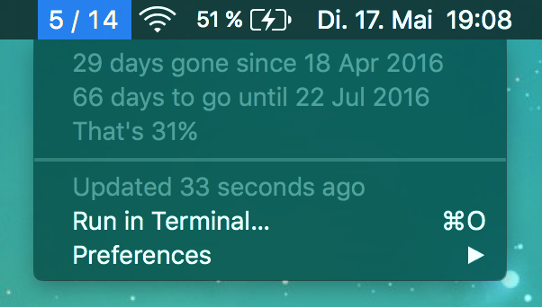

Just a super simple [bitbar](https://github.com/matryer/bitbar) plugin. You
choose two dates and the plugin displays how many weeks/days of that time range
passed.

I think it's too minimalistic to publish it in the official bitbar plugins repo,
so I decided to just put it this mini repo.

